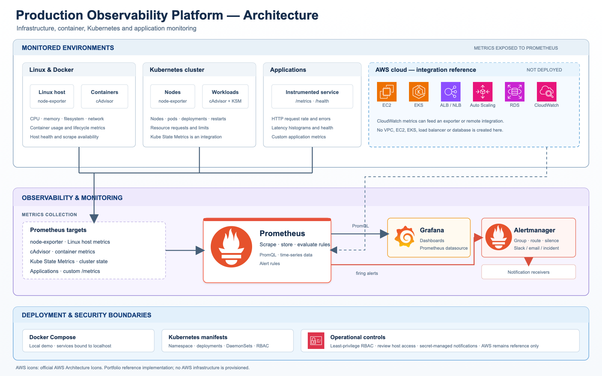

# Architecture

## Signal flow

Linux, Docker, Kubernetes, and instrumented applications expose metrics to Prometheus. Grafana queries Prometheus for dashboards. Prometheus sends firing alerts to Alertmanager, which routes notifications to configured receivers. AWS service metrics are an optional architecture reference and are not provisioned by this project.

## Boundaries and deployment choices

The local Compose stack is a single-host demonstration. The Kubernetes manifests provide a learning baseline for Prometheus, Grafana, node-exporter, and cAdvisor. Kube State Metrics is an integration target, not a deployment in this repository. Review RBAC, host mounts, storage, credentials, and network exposure before using these manifests in a production cluster.

The AWS services in the diagram are integration references only. The repository does not create VPCs, EC2, EKS, load balancers, Auto Scaling groups, RDS, or other cloud resources.
