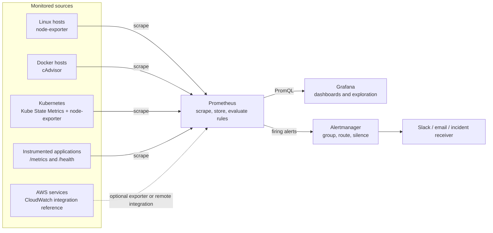

# Architecture

## Signal flow

## Boundaries and deployment choices

The local Compose stack is a single-host demonstration. Prometheus scrapes local exporters and the demo application; Grafana and Alertmanager consume that Prometheus instance. In Kubernetes, Prometheus and Grafana run in the `observability` namespace, while node-exporter and cAdvisor run as DaemonSets. Application `/metrics` endpoints and Kube State Metrics must be added to scrape configuration for a target cluster.

AWS is an architecture reference: EC2/EKS workloads can expose Prometheus metrics, and CloudWatch metrics can be bridged using an appropriate exporter or remote integration. This repository does not create VPCs, load balancers, clusters, databases, or other cloud resources.
